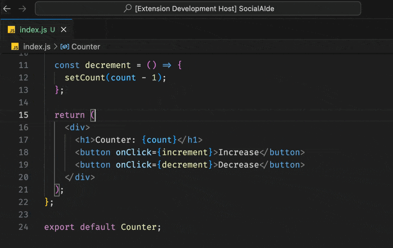

# Hardcoded String Replacer

This Visual Studio Code extension helps you replace hardcoded strings with localized string keys and automatically updates a JSON file with the key-value pairs.

## Demo

## Features

- Replace selected text with a localized string key format
- Automatically add the original text and key to a JSON file
- Configurable replacement format
- Command to set custom replacement format

## Usage

1. Select the text you want to replace with a localized string key.
2. Open the Command Palette (Ctrl+Shift+P or Cmd+Shift+P).
3. Run the "Replace with localized string key" command.
4. Enter the key for the localized string when prompted.
5. The selected text will be replaced with the localized string format, and the key-value pair will be added to `localized_strings.json` in your project root.

## Configuration

You can customize the replacement format:

1. Open the Command Palette.
2. Run the "Set localization replacement format" command.
3. Enter your desired format, using `${key}` as a placeholder for the localization key.

The default format is `${t('${key}')}`.

## Extension Settings

This extension contributes the following settings:

* `localizationReplacement.format`: The format used for replacing text with localized string keys. Default is `${t('${key}')}`.

## Known Issues

- The extension currently only supports one workspace folder.
- The JSON file is always created in the root of the workspace.

## Release Notes

### 1.0.0

Initial release of Localization String Replacement
